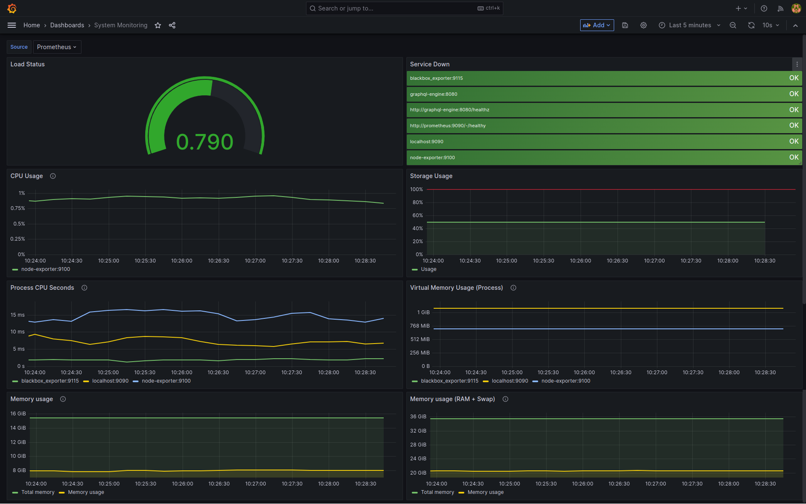
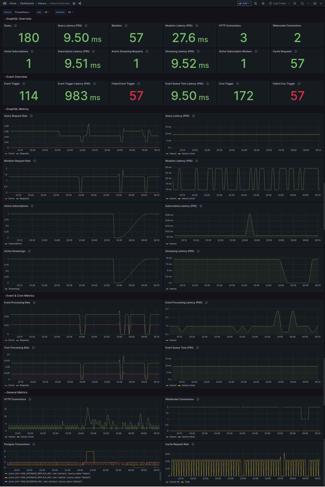
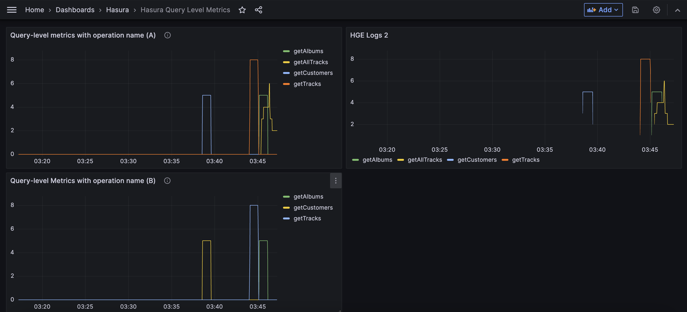
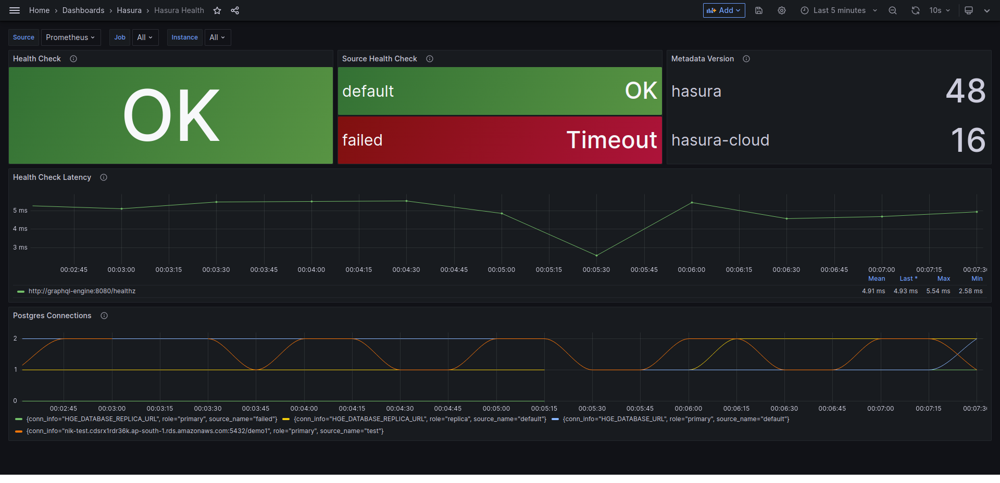
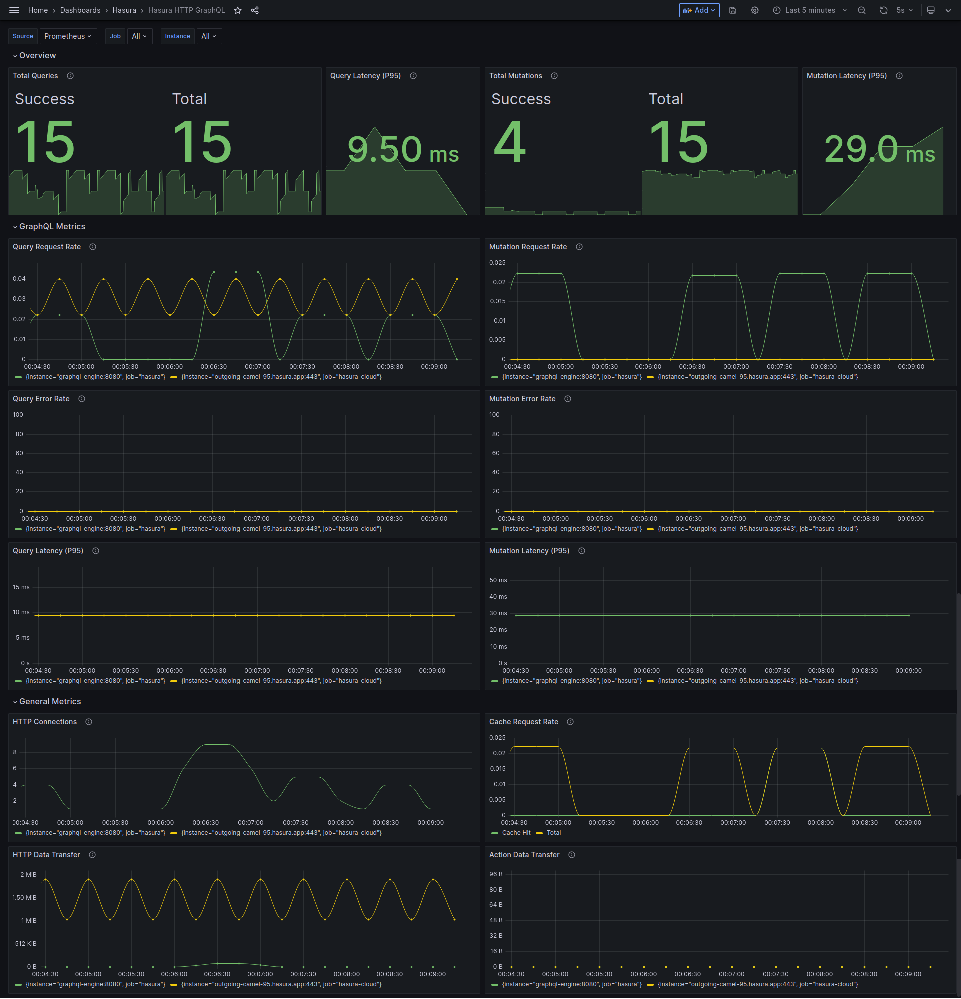
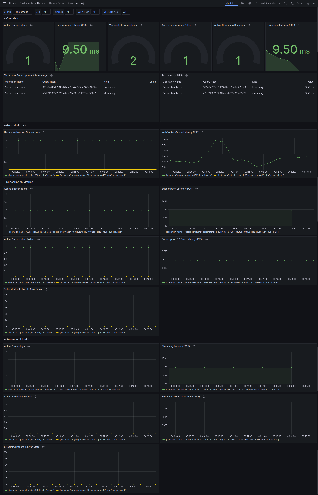
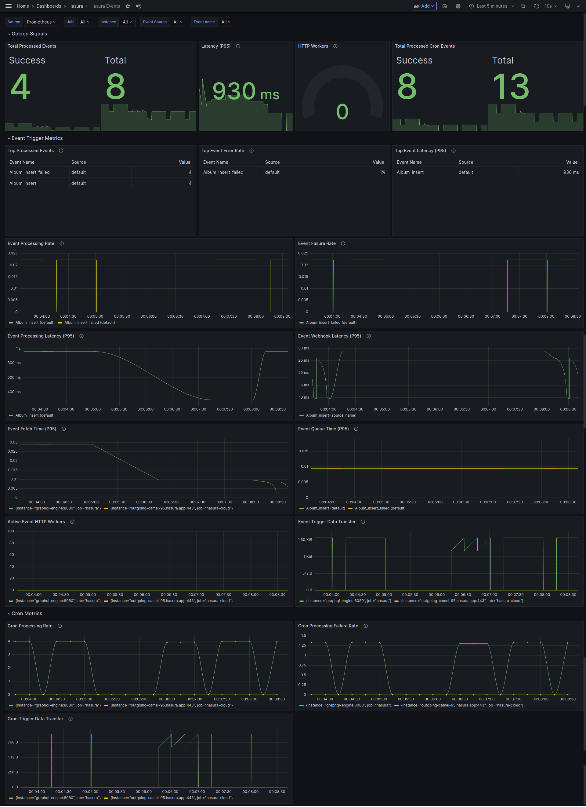
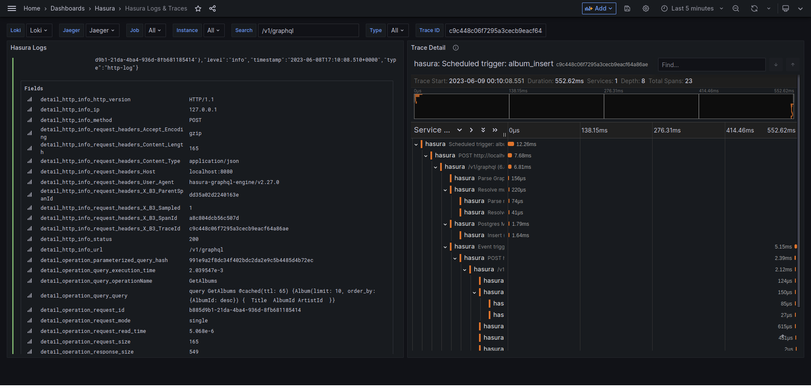
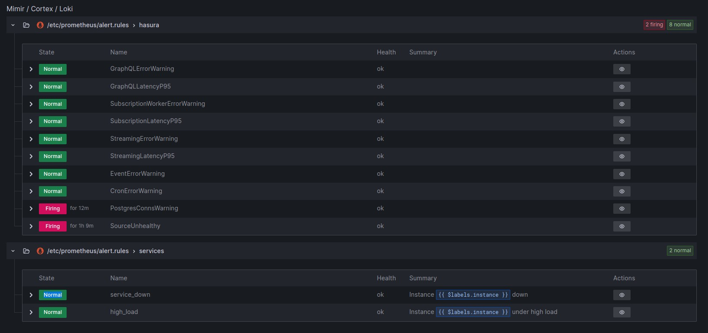

# Hasura Enterprise Observability Demo

This branch contains demo for setting up observability infra for visualizing logs and metrics from Hasura graphql-engine.

The logs emitted by graphql-engine will be captured by promtail agent and it will forward to Loki. In Grafana, we create visualizations based on Prometheus and Loki's data source.

#### Main Objective

The main objective of this project was to create grafana board for query-level metrics with operation names alongside other hasura metrics.

In order to collect query level metrics with operation names, you'll need to get hasura's query-level logs inside Grafana.

Here's how it goes in order:

- Promtail agent running inside container collects the logs from graphql-engine.
- It forwards to Loki and it gets collected eventually in Grafana
- Grafana visualization would create time series graph displaying rate of operation over time with operation name

#### Query level metrics with two setups

The query level metrics dashboard comes with two optional visualizations, separated by (A) and (B) label distinctively.

(A): This visualization contains Grafana query for capturing query logs separated by operation name using pattern expression logic. See example of `query-log` in `query_log_outside_console.json` file.

(B): This visualization contains Grafana query for capturing query logs which has `operationName` using it for distinct results separated by operation name. It uses json parser expression.  See example of `query-log` in `query_log_from_console.json` file.

**Caveat**: (B) visualization won't work in case if you don't explicitly pass `operationName` alongside request payload when making request to `v1/graphql` endpoint.

## Get Started

- create .env file
- Copy `dotenv` to `.env` and configure secrets and EE License Key.
- Try `docker-compose` locally with `docker-compose up -d`, or run the Docker Swarm stack with scripts that are in the `util` folder.

#### Checks
- Make sure you've `query-log` log is included in `HASURA_GRAPHQL_ENABLED_LOG_TYPES` env var's values.

## Components

Here's a list of all the services that are created:

| Service       | Port  | Description                    | Notes                                                              |
| ------------- | :---: | ------------------------------ | -------------------------------------------------------------------|
| Prometheus    | :9090 | Data                           |                                                                    |
| Checks        |       |                                |                                                                    |
| Grafana       | :3000 | UI To Show Prometheus Data     | Username: `admin`, Password: `HGEMonitoring!`                      |
| HGE           | :8080 | Hasura GraphQL Engine          |                                                                    |
| Postgres      | :5432 | Postgres 15 Database Container |                                                                    |
| Loki          | :3100 | Loki Logging Collector         |                                                                    |
| Promtail      |       | Pushes logs to Loki            | Runs as a sidecar to HGE service. Responsible for collecting logs. |

### Grafana Dashboards

Dashboard templates are collected in the [dashboards/hasura](grafana/dashboards/hasura) folder. You can import those files to your config folders where the Grafana service is configured, or [import them directly](https://grafana.com/docs/grafana/latest/dashboards/manage-dashboards/#import-a-dashboard) on the Grafana web UI.

## FAQs

**How can I enable metrics in the the Source Health panel**

> Currently, only Postgres supports source health check metrics.

To enable Source Health check metrics you need to configure the [health check metadata](https://hasura.io/docs/latest/deployment/health-checks/source-health-check/#configuring-source-health-check) for each data source.

## Screenshots

### Grafana Dashboards

### Alerts

